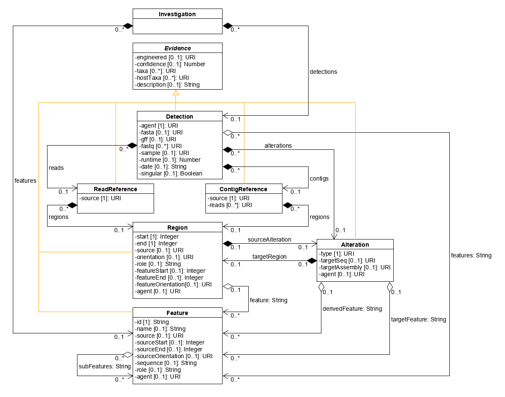

# installation

```
python setup.py install
```

# validate_detections.py

Can currently use to validate whether JSON adheres to the GUARDIAN JSON schema. For example:

```
python validate_detections.py -d examples\Y344 -s schema\detection_schema.json
```

Argument | Short Arg | Type | Description | Example
---- | --- | --- | --- | ---
`--schema_file` | `-s` | `String` | **Required**. Path to JSON schema for evidence of engineering. | schema\detection_schema.json
`--detection_files` | `-d` | `String` | **Optional**. List of paths to JSON files (or single directory for files) containing evidence of engineering to integrate. | examples\Y344

# DetectionsToCSV.py

Can use to integrate/ensemble evidence of engineering encoded using the GUARDIAN JSON schema and convert it to a CSV summary. For example:

```
cd evidenceintegration
python DetectionsToCSV.py –d ..\examples\Y344 –o ..\examples_output\Y344 –i
```

In this example, the integrated JSON output will appear as Y344.json and its CSV summary will appear as guardian-out.csv in the directory examples_output\Y344. Reference output files for comparison can be found in examples_output_reference\Y344.

Argument | Short Arg | Type | Description | Example
---- | --- | --- | --- | ---
`--json_files` | `-j` | `String` | **Optional**. List of paths to JSON files containing evidence of engineering to integrate and summarize as CSV. | Y344_JHUARDIAN_v4.json Y344_NGRAM.json Y344_TARGETED_SEARCH.json
`--json_dirs` | `-d` | `String` | **Optional**. List of paths to directories for JSON files containing evidence of engineering to integrate. | examples\Y344
`--out_dir` | `-o` | `String` | **Optional**. Path to output directory to populate with JSON file containing integrated evidence and CSV summary. | examples_output\Y344
`--integration_log` | `-l` | `String` | **Optional**. Path to log file. | examples_output\Y344\integration_log.txt
`--integrate` | `-i` | `Boolean` | **Optional**. If included, integrate evidence of engineering. Otherwise, just combine evidence into single JSON file without integrating it.  | -i

# GUARDIAN JSON Schema and Data Model

The GUARDIAN JSON schema, including short descriptions and examples of its individual properties, can be found in schema/detection_schema.json. Note that instances of the JSON schema are allowed to have as many custom properties as a user wants provided that their names do not conflict with the names of the properties described in this section. We take advantage of this during GFF-to-JSON conversion to preserve custom GFF annotation attributes that do not have a mapping to a property in the JSON schema.

Below is a UML diagram and class-based description of the data model that is implemented by the GUARDIAN JSON schema. Many properties of this data model are Uniform Resource Identifier (URI) references. A full discusison of URI syntax is beyond the scope of this README, but a typical URI consists of a scheme followed by an authority and a path. A URI reference can either be a URI or a relative reference that omits a portion from the start of the URI. For example, a URI identifying the Pgal10 promoter could be https://funyes.bbn.com/Pgal10, and its URI reference could be //funyes.bbn.com/Pgal10 or just Pgal10.



_The Investigation Class_

The purpose of the Investigation class is to aggregate evidence of organism engineering and any sequence features that may be referred to by this evidence. The "detections" property is an optional list of Detection objects that each indicate whether or not engineering has been detected in a sequencing data set.

The "features" property is an optional list of Feature objects, each representing a sequence feature that may be referred to as (or by) evidence of organism engineering.

_The Evidence Class_

The Evidence class is an abstract class that groups properties common to evidence of organism engineering. In the current data model, Detection, Read, Contig, Region, Feature, and Alteration are all subclasses of Evidence.  

The "engineered" property is an optional URI reference that identifies whether the Evidence is natural, engineered, or of indeterminate origin. If this property is non-empty, then it must be must be one of the following:
- http://guardian.bbn.technology#natural
- http://guardian.bbn.technology#engineered
- http://guardian.bbn.technology#indeterminate_origin

The "confidence" property is an optional number between 0 and 1, inclusive, that specifies the estimated probability that the value of the "engineered" property is correct.

The "hostTaxa" property is an optional list of URI references for the taxonomic classification of the host for the Evidence. For example, one such URI reference could identify a term from the NCBI organismal classification ontology, or it could identity an SBOL ModuleDefinition. A list of URIs for terms from the NCBI ontology that correspond to the target organisms that we have worked with so far in FELIX can be found in the [wiki for the FELIX repo](https://gitlab.bbn.com/FELIX/FELIX/-/wikis/Batch-4-Target-Taxa). When this property contains multiple URIs, it is recommended that these URIs refer to related taxa. For example, the "hostTaxa" property for a yeast host could contain two URIs that refer to two terms that are synonyms for the species S. cerevisiae. Alternatively, one of these URIs could refer to a term for the species S. cerevisiae, and the other could refer to a term for the genus Saccharomyces.

The "taxa" property is an optional list of URI references for the taxonomic classification of the Evidence itself. For example, the Evidence could be a gene from E. coli, which in the NCBI organismal classification ontology is identified by the URI http://purl.obolibrary.org/obo/NCBITaxon_562.

The "description" property is an optional string that serves as a free text description of the Evidence.

The "scores" property is an optional list of Score objects, each representing a score that has some bearing on the value of the "engineered" property of this Evidence.

_The Score Class_

The purpose of the Score class is to represent a score associated with evidence of engineering. The only required property of this class is "value", which must contain a number. The value of a Score is expected to have some bearing on the value of the "engineered" property of the Evidence with which it is associated.

The "type" property is an optional URI reference to an ontology term that defines the type of this Score.

The "minValue" property is an optional number that specifies the lowest possible value of the "value" property of this Score.

The "maxValue" property is an optional number that specifies the highest possible value of the "value" property of this Score.

The "lowerThreshold" property is an optional number that specifies a threshold for an engineering call. If the "value" property of this Score is less than this threshold, then the "engineered" property of the Evidence associated with this Score must be "http://guardian.bbn.technology#engineered".

The "upperThreshold" property is an optional number that specifies a threshold for an engineering call. If the "value" property of this Score is greater than this threshold, then the "engineered" property of the Evidence associated with this Score must be "http://guardian.bbn.technology#engineered".

_The Detection Class_

The purpose of the Detection class to indicate whether or not evidence of engineering has been detected in a sequencing data set. The only required property of this class is a URI reference to the "agent" that made the detection (typically a piece of software).

The "fasta" and "fastq" properties are URI references to the FASTA and FASTQ files associated with a Detection. While these properties are optional, at least one of them should be non-empty in practice.

The "gff" property is an optional URI reference to a GFF file paired with the Detection's FASTA file. The Detection may be derived from the contents of the GFF file, but the GFF file may also contain metadata that are not necessarily captured by the Detection.

The "sample" property is an optional URI reference to the sample from which the Detection's FASTA/FASTQ files were collected or generated.

The "runtime" property is an optional number of minutes taken by the agent to perform the analysis for the Detection.

The "date" property is an optional string specifying the date that the agent performed the analysis for the Detection. For example, 08/11/2019 is a valid date.

The "reads" property is an optional list of ReadReference objects that each represent a reference to a sequencing read that is potentially evidence of engineering.

The "contigs" property is an optional list of ContigReference objects that each represent a reference to an assembly contig that is potentially evidence of engineering.

The "features" property is an optional list of string ID references to Feature objects that each represent a sequence feature that has been detected as potential evidence of engineering.

The "alterations" property is an optional list of Alteration objects that each represent a sequence alteration that has been detected as potential evidence of engineering.

The "singular" property is an optional Boolean that, if true, indicates that the Detection is for a single signature. If false, this property indicates that the Detection is for multiple signatures.

_The ReadReference Class_

The purpose of the ReadReference class is to indicate whether or not evidence of engineering has been detected in the referenced sequencing read. The only required property of this class is a "source" URI reference to a sequencing read, typically a sequence identifier following an @ symbol in a FASTQ file. In the current data model, it is recommended that this sequence identifier come from one of the FASTQ files reference by the "fastq" property of the ReadReference's parent Detection.

The "regions" property is an optional list of Region objects that have been detected as potential evidence of engineering.

_The ContigReference Class_

The purpose of the ContigReference class is to indicate whether or not evidence of engineering has been detected in the referenced assembly contig. The only required property of this class is a "source" URI reference to an assembly contig, typically an NCBI SeqID or a sequence identifier following a > symbol in a FASTA file. In the current data model, it is recommended to use a sequence identifier from the FASTA file referenced by the "fasta" property of the ContigReference's parent Detection.

The "reads" property is an optional list of URI references to the sequencing reads from which the source contig was assembled.

The "regions" property is an optional list of Region objects that have been detected as potential evidence of engineering.

_The Region Class_

The purpose of the Region class is to indicate whether or not evidence of engineering has been detected in a sub-region of a referenced sequencing read or assembly contig. The only required properties of this class are the "start" and "end" integers that specify the inclusive range of the region of interest within the sequence of the read/contig (a 1-based coordinate system is used per the GFF standard). The "end" of a Region must be greater than or equal to its "start". To specify a region of length zero immediately above an index, set both its start and end properties to the index and its orientation property to the URI for "inline" (see below). To specify such a region immediately below an index, set its orientation property to the URI for "reverseComplement".

The "orientation" property is an optional URI reference to the orientation of the Region. If this property is missing, then the orientation of the Region can be assumed to be inline. If this property is non-empty, then it must be either of the following:
- http://sbols.org/v2#inline
- http://sbols.org/v2#reverseComplement.

The "source" property is an optional URI reference to the Region's source, typically the ID attribute of an annotation in a GFF file. In the current data model, it is recommended to use the ID of an annotation from the GFF file referenced by the "gff" property of the Detection that contains this Region's parent Contig or Read.

The "role" property is an optional string that indicates the functional role of the Region (if any), such as "promoter", "CDS", or "terminator". It is recommended to use terms from the [sequence_feature branch](http://www.sequenceontology.org/browser/current_release/term/SO:0000110) of the Sequence Ontology.

The "feature" property is an optional string ID reference to a Feature object that aligns to the sequence delineated by this Region. If the Region has a "sourceAlteration", then the "derivedFeature" property of the "sourceAlteration" must match this ID. The Feature with this ID must be contained by the "features" property of the root Investigation. 

The "featureStart" property is an optional integer that specifies the start coordinate for the Feature associated with this Region. This start coordinate should be in the same coordinate system as the Region's start coordinate.

The "featureEnd" property is an optional integer that specifies the end coordinate for the Feature associated with this Region. This start coordinate should be in the same coordinate system as the Region's start coordinate.

The "featureOrientation" property is an optional URI reference to the orientation for the Feature associated with this Region. If this property is missing, then the orientation of the Feature that can be assumed to be inline. If this property is non-empty, then it must be either of the following:
- http://sbols.org/v2#inline
- http://sbols.org/v2#reverseComplement.

The "sourceAlteration" property is an optional Alteration object that represents a sequence alteration that resulted in this Region (or this Region's Feature if provided).

The "agent" property is an optional URI reference to the "agent" that detected this Region (typically a piece of software).

_The Feature Class_

The purpose of the Feature class is to represent a sequence feature that may be referred as (or by) negative or positive evidence of engineering. The only required properties of this class is the "id" string. The "id" property must only contain alphanumeric, underscore, dash, and dot characters. This ID must uniquely identify the Feature among other Features referred to by the "features" property of the root Investigation.

The "name" property is an optional string that is a common name for the Feature. This name does not have to be unique among the names of other Features referred to by the "features" property of the root Investigation.

The "source" property is an optional URI reference to an external record of the Feature. It is recommended to use either an NCBI SeqID or the identity of an SBOL ComponentDefinition.

The "sourceStart" property is an optional integer that specifies the start coordinate for the Feature with respect to its source. This start coordinate should be in the same coordinate system as its source.

The "sourceEnd" property is an optional integer that specifies the end coordinate for the Feature with respect to its source. This end coordinate should be in the same coordinate system as its source.

The "sourceOrientation" property is an optional URI that identifies the orientation this Feature with respect to its source.

The "sequence" property is an optional string that must only contain characters from the IUPAC DNA codes, such as "a", "t", "c", "g", and "n".

The "role" property is an optional string that indicates the functional role of the Feature (if any), such as "promoter", "CDS", or "terminator". It is recommended to use terms from the [sequence_feature branch](http://www.sequenceontology.org/browser/current_release/term/SO:0000110) of the Sequence Ontology.

The "subFeatures" property is a list of IDs identifying sub-features of this Feature. These sub-features should be listed in the order in which they occur in this Feature feature.

The "agent" property is an optional URI reference to the "agent" that detected this Feature (typically a piece of software).

_The Alteration Class_

The purpose of the Alteration class is to represent a sequence alteration that may be referred to as (or by) negative or positive evidence of engineering. The only required property of this class is a "type" string that summarizes the sequence alteration. It is recommended to use a term from the [sequence_alteration branch](http://sequenceontology.org/browser/current_release/term/SO:0001059) of the Sequence Ontology such as "insertion" or "deletion".

The "derivedFeature" property is a string ID reference to a Feature that represents a sequence feature resulting from this Alteration. This Feature must be contained by the "features" property of the root Investigation.

The "targetSeq" property is an optional URI reference to a sequence record that is the subject of this Alteration. It is recommended to use an NCBI SeqID.

The "targetAssembly" property is an optional URI reference to the target genome assembly that is the background for the subject of this Alteration. It is recommended to use an NCBI SeqID.

The "targetFeature" property is a string ID reference to a Feature that represents a sequence feature in the target sequence record that is the subject of this Alteration (e.g. a gene to be partially or completely deleted from the target sequence record). This Feature must be contained by the "features" property of the root Investigation.

The "targetRegion" property is an optional Region object the represents the exact region in the target sequence record that is the subject of this Alteration (e.g. an exact region to be deleted from the target sequence record).

The "agent" property is an optional URI reference to the "agent" that detected this Alteration (typically a piece of software).